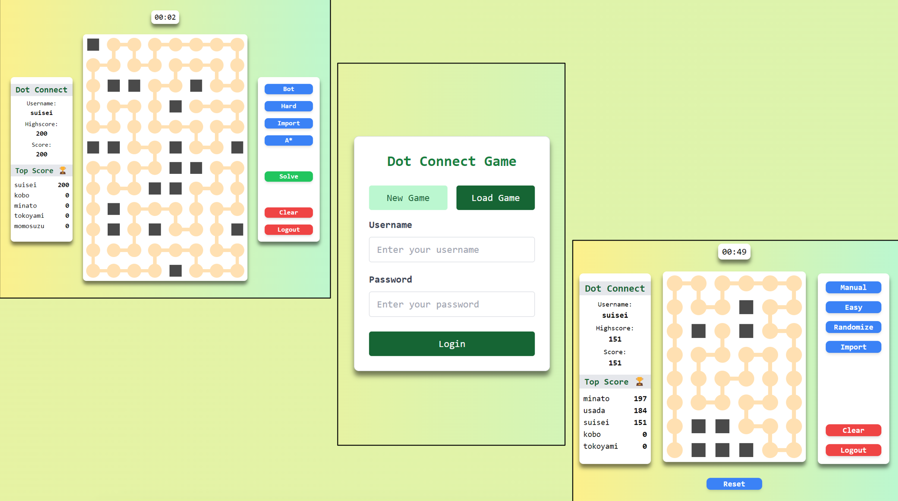

# Dot Connect Game 
> Task 4 Seleksi Lab IRK - Ahmad Rafi Maliki 13522137

## Deskripsi

Aplikasi ini merupakan permainan Dot Connect dan juga Solver nya

## Teknologi Yang Digunakan

### Bahasa Pemrograman:
1. HTML
2. CSS
3. JavaScript
   
### Framework:
1. React
2. TailwindCSS
   
### Deployment:
1. Vercel

### Database
1. [jsonbin.io](https://jsonbin.io/app)


## Algoritma

1. A*
Pada pemodelan permainan ini, algoritma A* telah dimodifikasi untuk mencari path dengan cost termahal agar semua jalur terlalui. Algoritma ini memiliki kompleksitas O(b^d) dimana b adalah banyaknya percabangan tiap simpul, dan d adalah jumlah simpul.
  
2. Backtracking
Pada pemodelan permainan ini, algoritma backtracking menggunakan fungsi heuristik untuk melakukan pruning terhadap branch yang dianggap tidak valid oleh fungsi tsb, yaitu kondisi papan yg unsolvable karena memiliki titik mati atau titik paksa lebih dari 1 Algoritma ini memiliki kompleksitas O(b^d) dimana b adalah banyaknya percabangan tiap simpul, dan d adalah jumlah simpul.
   
3. Greedy
Pada pemodelan permainan ini, algoritma greedy akan mengutamakan melakukan branching ke arah simpul yang letaknya dekat dengan pinggiran sehingga akan mengutamakan menjelajahi daerah terluar terlebih dahulu. Algoritma ini memiliki kompleksitas O(b^d) dimana b adalah banyaknya percabangan tiap simpul, dan d adalah jumlah simpul.  
  
4. Bruteforce
Pada pemodelan permainan ini, algoritma bruteforce akan secara urut melakukan penjelajahan simpul ke arah atas terlebih dahulu dan simpul berikutnya sesuai arah putaran jarum jam. Algoritma ini memiliki kompleksitas O(b^d) dimana b adalah banyaknya percabangan tiap simpul, dan d adalah jumlah simpul.

Walau keempat algoritma tersebut memiliki kompleksitas yang sama pada worst case nya, algoritma A* dan backtracking memiliki keunggulan yang lebih jauh dari greedy, dan lebih jauh lagi dari bruteforce karena adanya fungsi heuristik yang bagus.

## Cara menjalankan program

Aplikasi dapat diakses langsung pada [https://13522137-dot-connect.vercel.app](https://13522137-dot-connect.vercel.app/) atau

1. Clone project dan install dependency
```
git clone https://github.com/rafimaliki/13522137-Dot_Connect-Seleksi_IRK
cd 13522137-Dot_Connect-Seleksi_IRK/src
npm i
```
2. Jalankan development server
```
npm run dev
```
3. Akses frontend
```
http://localhost:5173/
```

## Cara menggunakan program



## Bonus yang diimplementasikan
1. Animasi jalannya algoritma
2. Model Algoritma


